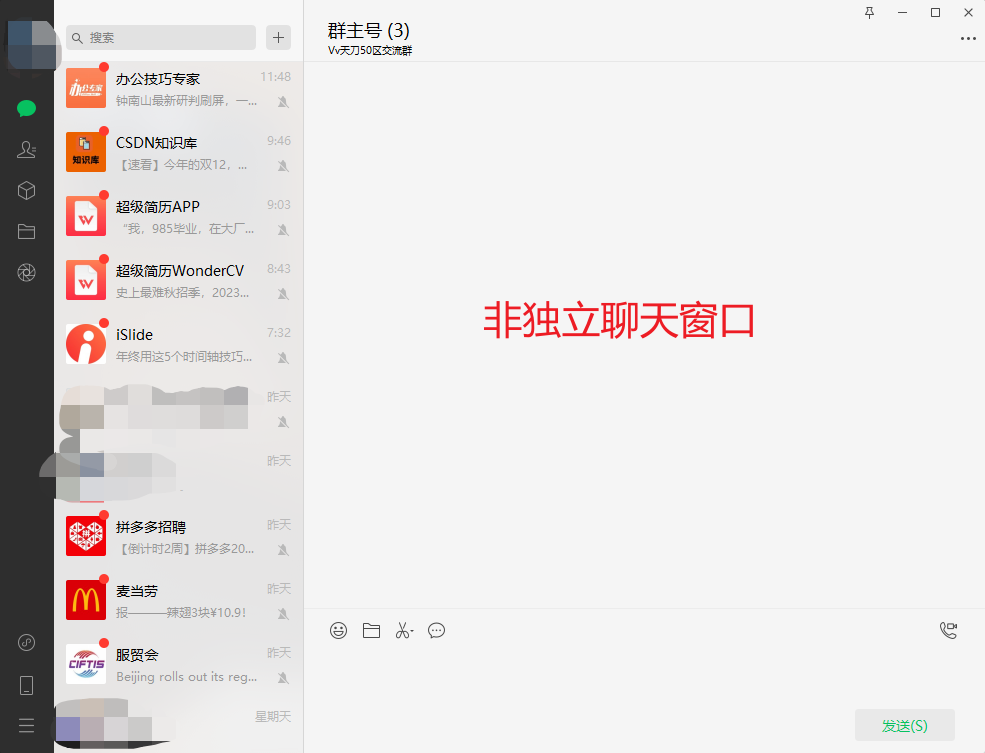
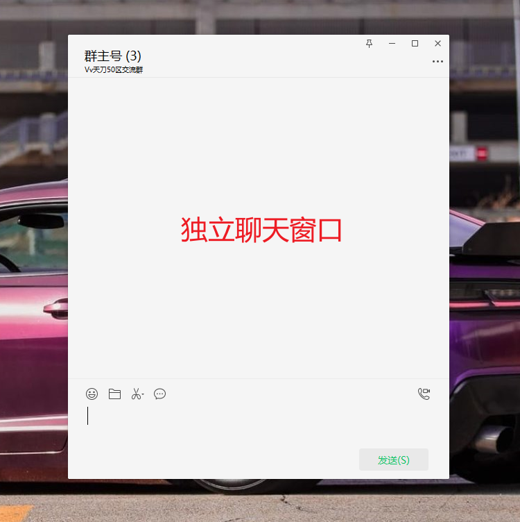
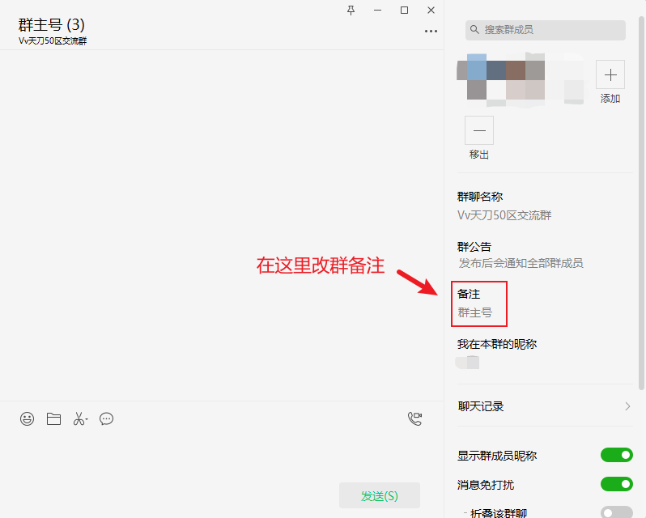
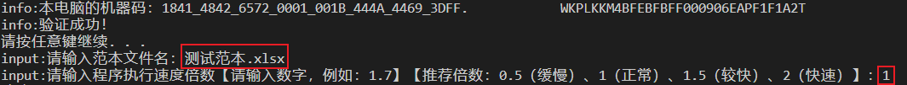

# 更新日志

## v1.1

1. 增加发送图片功能
2. 增加注册码配置文件认证功能

## v1.2

1. 增加发送链接卡片功能
2. 增加暂停&继续热键功能
3. 增加执行速度倍数调整功能

# 程序使用说明书

## 操作步骤

1. 配置注册码文件（仅**首次**运行程序需要配置）
   1. 运行程序，将机器码发送给**公司负责人**申请注册码；
   2. 将注册码粘贴进 config.txt 文件并保存；
   3. 重启程序，出现下图则表示注册码配置成功；
   4. 配置成功后，关闭程序进入下一步；
2. 编辑范本文件（仅**更换范本**文件时需要重新编辑）
   1. 第一列为‘角色名’，第二列为‘发送内容’；
   2. 若要发送**特殊内容**（*图片*和*链接*），请参考下文的**范本文件配置规则**进行配置；
   3. 配置完成后，保存文件后关闭范本，进入下一步；
3. 编辑微信窗口
   1. 双击微信群，让聊天窗口成为独立窗口【参考下图】 
   2. 设置微信群的备注成该微信号参演的‘角色名’【参考下图】
   3. **最小化**窗口【不要关闭窗口！】
   4. 重复此操作，编辑所有微信下的群聊窗口
4. 运行程序
   1. 双击程序，等待程序加载【注意：不要点击黑框；若点击黑框，按回车】
   2. 输入指定范本的文件名【例如：下图的范本文件名为‘测试范本.xlsx’】，按回车
   3. 输入指定执行速度倍数，按回车

## 功能说明

1. 暂停&继续
   1. 切回程序界面【黑窗口】
   2. 按‘p’暂停；按‘c’继续
   3. 【注意：按暂停后，程序继续发出一条内容为正常现象】
2. 发送图片
   1. 范本文件中‘内容’列修改成‘/pic’+‘图片名’【注意：图片名后缀不可省略】【参考下图】
   2. 将图片移入‘images’文件夹中
3. 发送链接
   1. 范本文件中‘内容’列修改成‘/link’+‘群聊名’【注意：不建议使用‘群备注’】【参考下图】
   2. 将链接打开成独立窗口，最小化链接窗口

